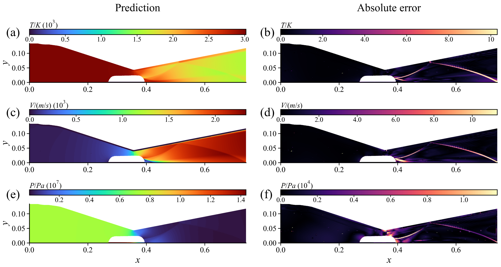
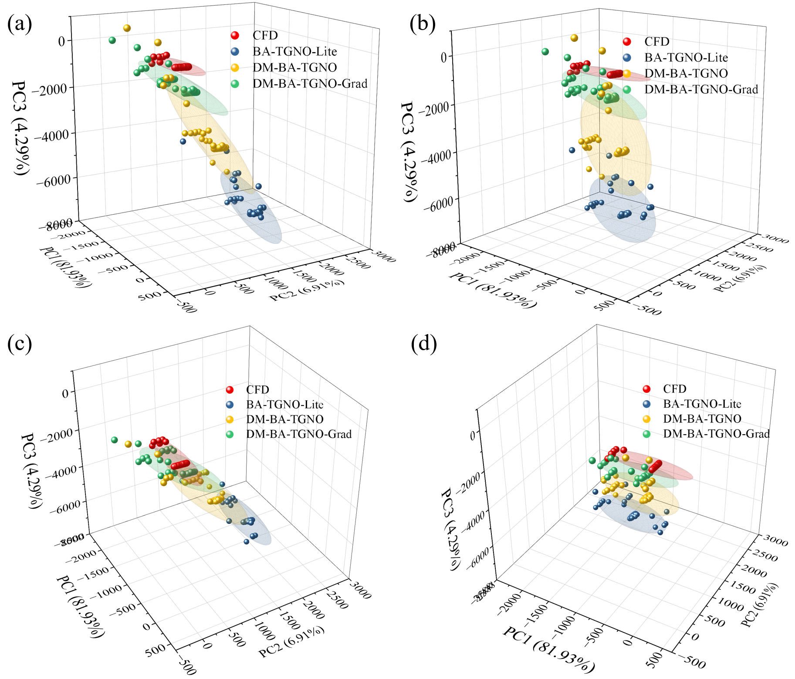
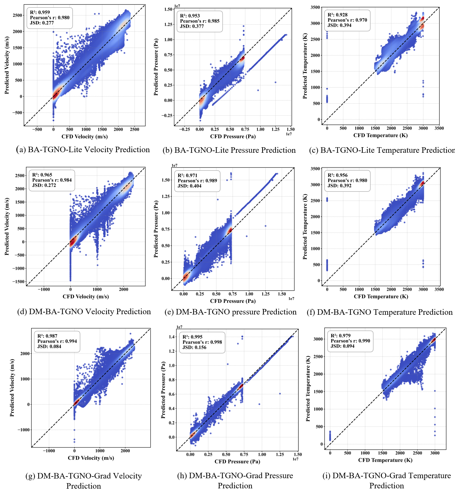

# DM-BA-TGNO
This repository contains the implementation of the paper: **"Dynamic-Mesh Boundary-Aware Temporal Graph Neural Operator for Complex Flow-Field
Prediction in Moving-Boundary Systems"**.

we propose a Dynamic-Mesh Boundary-Aware Temporal Graph Neural Operator, termed DM-BA-TGNO, for dynamic-mesh flow-field prediction in moving-boundary compressible flows.
Rather than treating the moving-pintle nozzle as an isolated engineering case, this study uses it as a representative dynamic-mesh configuration to investigate geometry-conditioned graph learning under prescribed boundary motion.

## 🚀 Key Contributions

* A geometry-conditioned dynamic-mesh learning formulation is developed for unsteady moving-boundary flow prediction.
The moving-pintle nozzle is used as a representative dynamic-mesh configuration, where the known boundary trajectory is exploited to predict transient flow fields directly on the deforming CFD mesh without Cartesian interpolation.

* A topology--geometry decoupled temporal graph representation is proposed, where fixed graph connectivity preserves node-wise temporal correspondence while dynamic node coordinates and edge attributes explicitly encode prescribed mesh motion.

* boundary-aware masking strategy is introduced to distinguish valid fluid regions from inactive geometric regions, reducing the influence of artificial padding and improving prediction near moving fluid--solid interfaces.

* An edge-wise graph-gradient consistency loss is developed to complement pointwise supervision and improve the preservation of shocks, separation interfaces, shear layers, and other sharp-gradient structures in compressible moving-boundary flows.

## 🛠️ Model Architecture

## 📊 Results

## 📧 Contact
Since our paper is currently under review, the detailed code and dataset will be uploaded after the paper is accepted. If you need the code and dataset recently, please contact us: Jinheng Yang: 124101022118@njust.edu.cn
